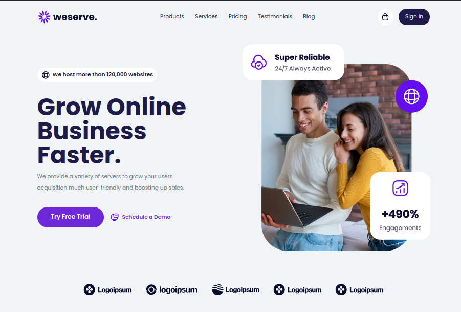

## Weserve (A Hosting Company)

This is fictitious company from design, Design by [ShaynaKit](https://shaynakit.com)



## Features

- Next.js
- TypeScript
- Framer Motion A Bit
- Shadcn UI
- Handling Error Pages & Structured Pattern

## On Progress

- Implement more Framer Motion
- Implement Navbar for Mobile
- Implement Next js metadata

## Getting Started With This Project

First, install the lib:

```bash
pnpm i
```

Second, run the development server:

```bash
pnpm dev
```

Open [http://localhost:3000](http://localhost:3000) with your browser to see the result.

Happy Coding :)
